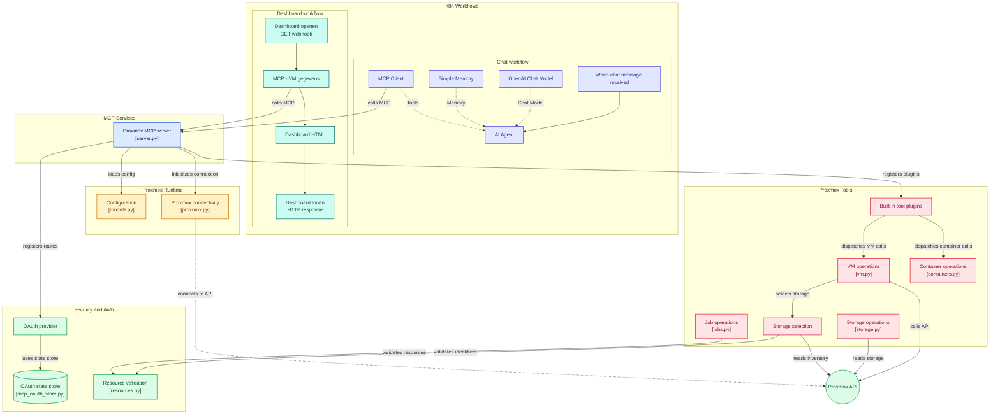

```mermaid
%% Generated by https://gitdiagram.com/ewoudboutje/network-experience-2627-n8n
flowchart TD

subgraph group_n8n_workflows["n8n Workflows"]
  direction TB

  subgraph group_chat_workflow["Chat workflow"]
    node_chat_trigger["When chat message received"]
    node_ai_agent["AI Agent"]
    node_openai_model["OpenAI Chat Model"]
    node_simple_memory["Simple Memory"]
    node_mcp_client["MCP Client"]
  end

  subgraph group_dashboard_workflow["Dashboard workflow"]
    node_dashboard_open["Dashboard openen<br/>GET webhook"]
    node_mcp_vm_data["MCP - VM gegevens"]
    node_dashboard_html["Dashboard HTML"]
    node_dashboard_show["Dashboard tonen<br/>HTTP response"]
  end
end

subgraph group_mcp_services["MCP Services"]
  node_proxmox_server["Proxmox MCP server<br/>[server.py]"]
end

subgraph group_proxmox_runtime["Proxmox Runtime"]
  node_proxmox_config["Configuration<br/>[models.py]"]
  node_proxmox_connection["Proxmox connectivity<br/>[proxmox.py]"]
end

subgraph group_security_auth["Security and Auth"]
  node_oauth_provider["OAuth provider"]
  node_oauth_store[("OAuth state store<br/>[mcp_oauth_store.py]")]
  node_resource_security["Resource validation<br/>[resources.py]"]
end

subgraph group_proxmox_tools["Proxmox Tools"]
  node_tool_plugins["Built-in tool plugins"]
  node_vm_tools["VM operations<br/>[vm.py]"]
  node_container_tools["Container operations<br/>[containers.py]"]
  node_storage_tools["Storage operations<br/>[storage.py]"]
  node_storage_selection["Storage selection"]
  node_job_tools["Job operations<br/>[jobs.py]"]
end

node_proxmox(("Proxmox API"))

node_chat_trigger --> node_ai_agent
node_openai_model -.->|"Chat Model"| node_ai_agent
node_simple_memory -.->|"Memory"| node_ai_agent
node_mcp_client -.->|"Tools"| node_ai_agent
node_mcp_client -->|"calls MCP"| node_proxmox_server

node_dashboard_open --> node_mcp_vm_data
node_mcp_vm_data --> node_dashboard_html
node_dashboard_html --> node_dashboard_show
node_mcp_vm_data -->|"calls MCP"| node_proxmox_server

node_proxmox_server -->|"loads config"| node_proxmox_config
node_proxmox_server -->|"initializes connection"| node_proxmox_connection
node_proxmox_server -->|"registers routes"| node_oauth_provider
node_oauth_provider -->|"uses state store"| node_oauth_store
node_proxmox_server -->|"registers plugins"| node_tool_plugins
node_tool_plugins -->|"dispatches VM calls"| node_vm_tools
node_tool_plugins -->|"dispatches container calls"| node_container_tools
node_vm_tools -->|"calls API"| node_proxmox
node_storage_tools -->|"reads storage"| node_proxmox
node_vm_tools -->|"selects storage"| node_storage_selection
node_storage_selection -->|"validates identifiers"| node_resource_security
node_storage_selection -->|"reads inventory"| node_proxmox
node_job_tools -->|"validates resources"| node_resource_security
node_proxmox_connection -.->|"connects to API"| node_proxmox

click node_proxmox_server "https://github.com/ewoudboutje/network-experience-2627-n8n/blob/main/Proxmox_agent_dashboard/proxmox-agent/source/src/proxmox_mcp/server.py"
click node_proxmox_config "https://github.com/ewoudboutje/network-experience-2627-n8n/blob/main/Proxmox_agent_dashboard/proxmox-agent/source/src/proxmox_mcp/config/models.py"
click node_proxmox_connection "https://github.com/ewoudboutje/network-experience-2627-n8n/blob/main/Proxmox_agent_dashboard/proxmox-agent/source/src/proxmox_mcp/core/proxmox.py"
click node_oauth_provider "https://github.com/ewoudboutje/network-experience-2627-n8n/blob/main/Proxmox_agent_dashboard/proxmox-agent/source/src/proxmox_mcp/mcp_oauth_provider.py"
click node_oauth_store "https://github.com/ewoudboutje/network-experience-2627-n8n/blob/main/Proxmox_agent_dashboard/proxmox-agent/source/src/proxmox_mcp/mcp_oauth_store.py"
click node_tool_plugins "https://github.com/ewoudboutje/network-experience-2627-n8n/blob/main/Proxmox_agent_dashboard/proxmox-agent/source/src/proxmox_mcp/services/builtin_tool_plugins.py"
click node_vm_tools "https://github.com/ewoudboutje/network-experience-2627-n8n/blob/main/Proxmox_agent_dashboard/proxmox-agent/source/src/proxmox_mcp/tools/vm.py"
click node_container_tools "https://github.com/ewoudboutje/network-experience-2627-n8n/blob/main/Proxmox_agent_dashboard/proxmox-agent/source/src/proxmox_mcp/tools/containers.py"
click node_storage_tools "https://github.com/ewoudboutje/network-experience-2627-n8n/blob/main/Proxmox_agent_dashboard/proxmox-agent/source/src/proxmox_mcp/tools/storage.py"
click node_storage_selection "https://github.com/ewoudboutje/network-experience-2627-n8n/blob/main/Proxmox_agent_dashboard/proxmox-agent/source/src/proxmox_mcp/tools/storage_selection.py"
click node_job_tools "https://github.com/ewoudboutje/network-experience-2627-n8n/blob/main/Proxmox_agent_dashboard/proxmox-agent/source/src/proxmox_mcp/services/jobs.py"
click node_resource_security "https://github.com/ewoudboutje/network-experience-2627-n8n/blob/main/Proxmox_agent_dashboard/proxmox-agent/source/src/proxmox_mcp/security/resources.py"
click node_chat_trigger "https://github.com/ewoudboutje/network-experience-2627-n8n/blob/main/Proxmox_agent_dashboard/workflow.json"
click node_ai_agent "https://github.com/ewoudboutje/network-experience-2627-n8n/blob/main/Proxmox_agent_dashboard/workflow.json"
click node_openai_model "https://github.com/ewoudboutje/network-experience-2627-n8n/blob/main/Proxmox_agent_dashboard/workflow.json"
click node_simple_memory "https://github.com/ewoudboutje/network-experience-2627-n8n/blob/main/Proxmox_agent_dashboard/workflow.json"
click node_mcp_client "https://github.com/ewoudboutje/network-experience-2627-n8n/blob/main/Proxmox_agent_dashboard/workflow.json"
click node_dashboard_open "https://github.com/ewoudboutje/network-experience-2627-n8n/blob/main/Proxmox_agent_dashboard/workflow.json"
click node_mcp_vm_data "https://github.com/ewoudboutje/network-experience-2627-n8n/blob/main/Proxmox_agent_dashboard/workflow.json"
click node_dashboard_html "https://github.com/ewoudboutje/network-experience-2627-n8n/blob/main/Proxmox_agent_dashboard/workflow.json"
click node_dashboard_show "https://github.com/ewoudboutje/network-experience-2627-n8n/blob/main/Proxmox_agent_dashboard/workflow.json"

classDef toneNeutral fill:#f8fafc,stroke:#334155,stroke-width:1.5px,color:#0f172a
classDef toneBlue fill:#dbeafe,stroke:#2563eb,stroke-width:1.5px,color:#172554
classDef toneAmber fill:#fef3c7,stroke:#d97706,stroke-width:1.5px,color:#78350f
classDef toneMint fill:#dcfce7,stroke:#16a34a,stroke-width:1.5px,color:#14532d
classDef toneRose fill:#ffe4e6,stroke:#e11d48,stroke-width:1.5px,color:#881337
classDef toneIndigo fill:#e0e7ff,stroke:#4f46e5,stroke-width:1.5px,color:#312e81
classDef toneTeal fill:#ccfbf1,stroke:#0f766e,stroke-width:1.5px,color:#134e4a
class node_proxmox_server toneBlue
class node_proxmox_config,node_proxmox_connection toneAmber
class node_oauth_provider,node_oauth_store,node_resource_security,node_proxmox toneMint
class node_tool_plugins,node_vm_tools,node_container_tools,node_storage_tools,node_storage_selection,node_job_tools toneRose
class node_chat_trigger,node_ai_agent,node_openai_model,node_simple_memory,node_mcp_client toneIndigo
class node_dashboard_open,node_mcp_vm_data,node_dashboard_html,node_dashboard_show toneTeal
```
